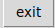

# number_indentification_CNN

## About number_indentification_CNN:

* It's a machine learning project.

* This project uses [tensorflow](https://www.tensorflow.org/) to do an [convolutional neural network](https://en.wikipedia.org/wiki/Convolutional_neural_network).

* number_identification_CNN is composed of two scripts, `train_cnn.py` and `use_model.py`.

### About `train_cnn.py`:

* `train_cnn.py` uses [tensorflow](https://www.tensorflow.org/) to create an CNN, train CNN and save the model in tmp.

* `train_cnn.py` calls init_net5 in `cnn_architecture.py` to create [LeNet5](http://yann.lecun.com/exdb/lenet/).

* `train_cnn.py` uses gradientDescenteOptimizer with mini batch to train weights.

* The cost function is a cross entropy.

* This script uses a softmax function in output layer.

* You can also use AdamOptimizer if you remove comment on line 82, and put a comment on line 81.

* Another architecture is available in `train_cnn.py`, it's a random CNN find on a blog. You can remove comment on line 190, and put a comment on line 191 to get this arhcitecture.

### About `use_cnn.py`:

* `use_cnn.py` creates a window with a canvas where you can draw number like in paint:

* draw here:

* To predict number use predict button:

* To clear use clear button:

* To exit use exit button or kill script:

* When you use predict button, the prediction is shown, on the bottom, in draw canvas like this:

* After make a prediction you can clear or use predict button for an new prediction.

* This script uses [tkinter](https://en.wikipedia.org/wiki/Tkinter) to generate a window, canvas and button.

* This script uses tensorflow to restore model in tmp and uses to do new predictions.

* It's use [openCV](https://opencv.org/) to resize image in (28, 28).

* _**If you are on linux distribution remove comment line 20, and comment line 19, because pysceenshot doesn't work on macOS.**_

### About data train and test:

* trainset and testset are in idx format.

* Data comes from [the MNIST database of handwritten digits](http://yann.lecun.com/exdb/mnist/index.html).

* trainset contains 60k exemples, and the testset contains 10k exemples.

* `train-images-idx3-ubyte` is the images and `train-labels-idx1-ubyte` is classes of image. It's the same for testset.

## What do you need to make number_indentification_CNN work

* python >= 3.0 

* [numpy](http://www.numpy.org/)

* [openCV](https://opencv.org/)

* [tensorflow](https://www.tensorflow.org/)

* [tkinter](https://en.wikipedia.org/wiki/Tkinter)

* [matplotlib](https://matplotlib.org/)

## Usage:

* `python3 train_cnn.py train-images-idx3-ubyte train-labels-idx1-ubyte t10k-images-idx3-ubyte t10k-labels-idx1-ubyte`

* `python3 use_model.py`
